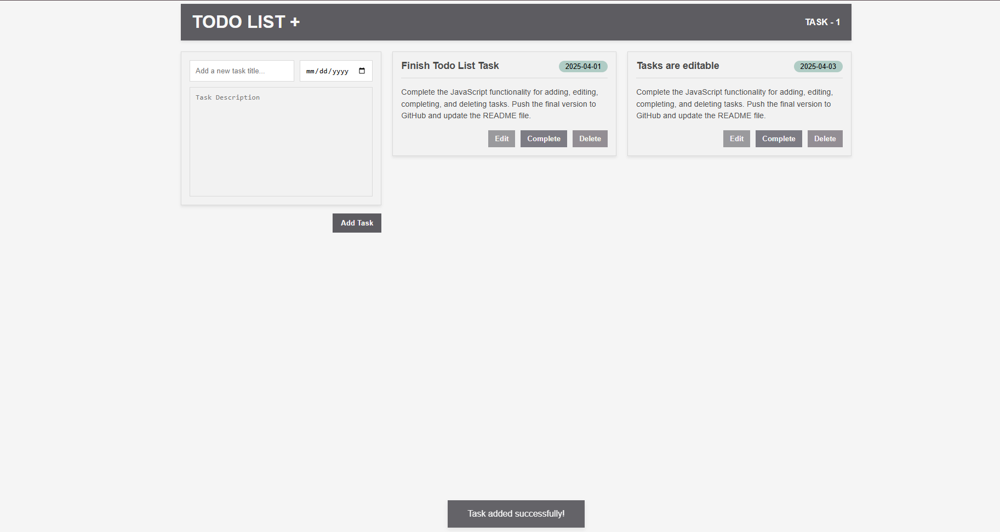
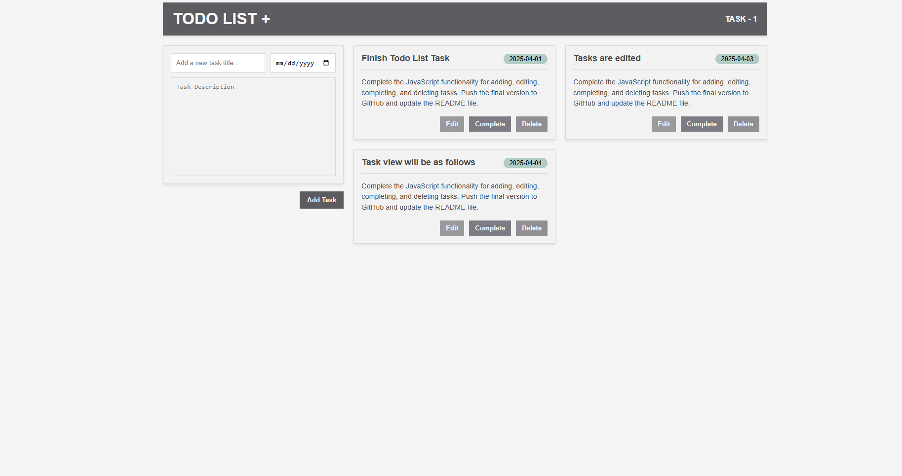
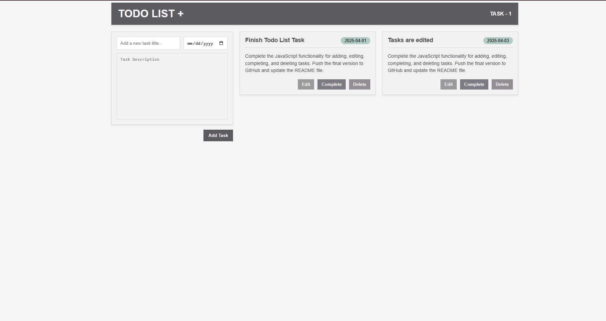
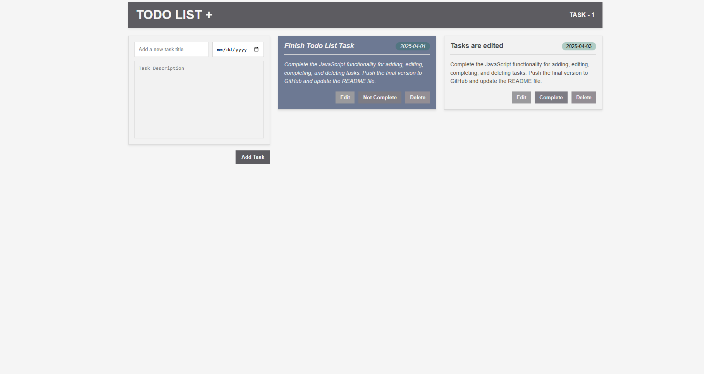

# Task 1 - Todo List App

A simple Todo List application built with HTML, CSS, and JavaScript. This project allows users to add tasks with a title, description, and deadline. Tasks can be edited, marked as completed, or deleted, and they are stored in the browser's local storage for persistence.

## Features

- **Add Tasks:** Create new tasks with a title, description, and deadline.
   - *Users can input task details and add them to the list.*
   - *Users can see the tasks in a grid*
- **Edit Tasks:** Update task details.
   - *Tasks can be modified after they have been created.*
   - *After the task is modified*
  
- **Complete Tasks:** Mark tasks as completed.
   - *Visually distinguish completed tasks from pending ones.*
- **Delete Tasks:** Remove tasks from the list.
  *Tasks can be permanently removed from the list as you can see on the previous image the modified task is removed*

- **Local Storage:** Tasks are saved in the browser for persistent data.
- **Notifications:** Display informative messages to the user using a toast notification system.
- **Test Suite:** Includes a comprehensive test suite to ensure code quality and prevent regressions.

## How to Run

1.  Open the `index.html` file in your web browser.

## How to Run Tests

1.  Navigate to the project directory in your terminal.
2.  Install the required packages by running `npm install` or `yarn install`.
3.  Run the tests using `npm test` or `yarn test`.
