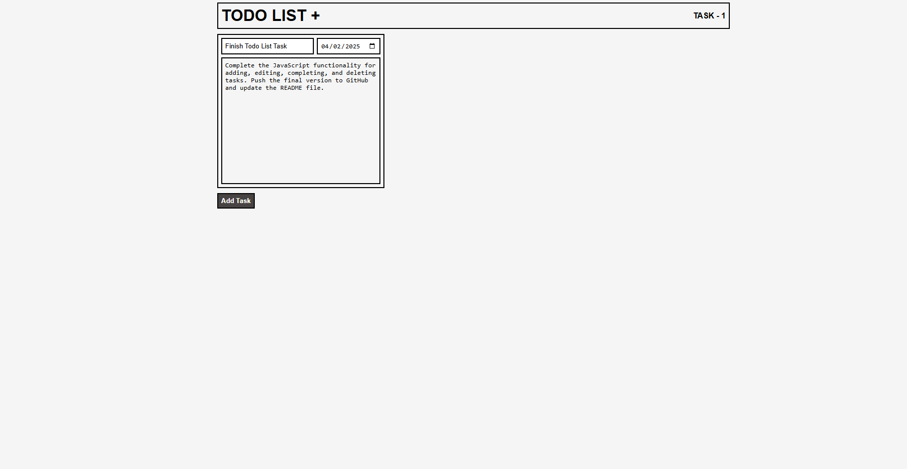
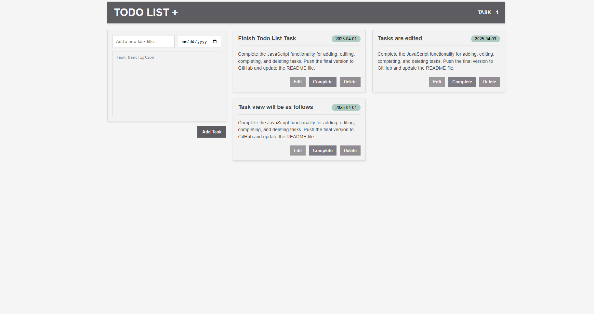
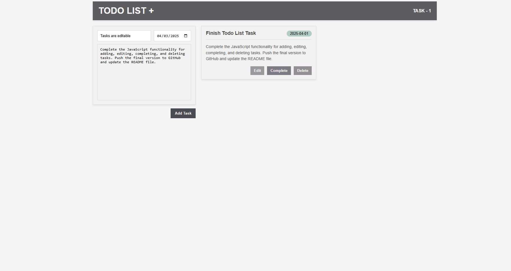
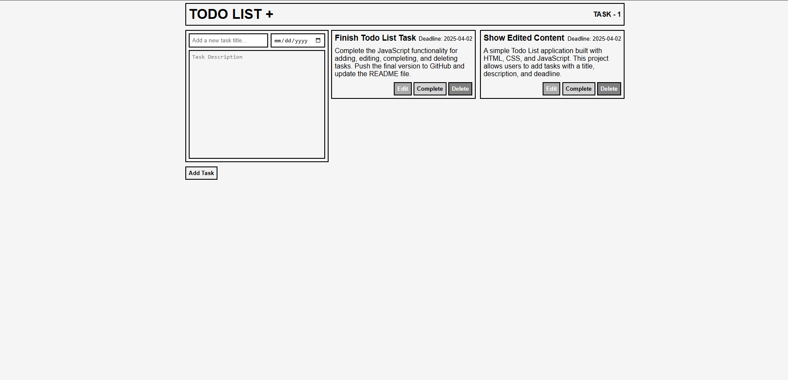
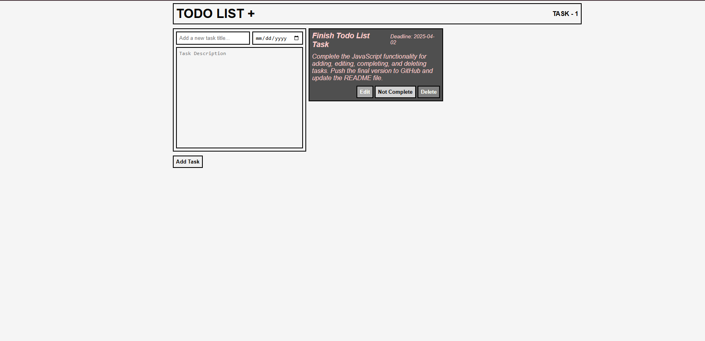

# Task 2 - Todo List App 

A simple Todo List application built with HTML, CSS, and Typescript. This project allows users to add tasks with a title, description, and deadline. Tasks can be edited, marked as completed, or deleted, and they are stored in the browser's local storage for persistence.

## Features

- **Add Tasks:** Create new tasks with a title, description, and deadline.
   - _Users can input task details and add them to the list._
   - _Users can see the tasks in a grid_
- **Edit Tasks:** Update task details.
   - _Tasks can be modified after they have been created._
   - _After the task is modified_
- **Complete Tasks:** Mark tasks as completed.
   - _Visually distinguish completed tasks from pending ones._
- **Delete Tasks:** Remove tasks from the list.
  _Tasks can be permanently removed from the list as you can see on the previous image the modified task is removed_

- **Local Storage:** Tasks are saved in the browser for persistent data.
- **Notifications:** Display informative messages to the user using a toast notification system.
- **Test Suite:** Includes a comprehensive test suite to ensure code quality and prevent regressions.
