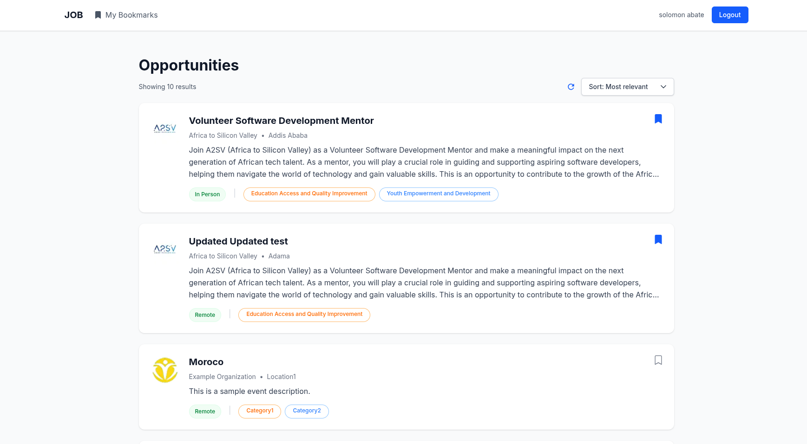

# Task 7 Job Listing Application 

A simple job listing application built with Next.js, TypeScript, and Tailwind CSS. This application allows users to browse job listings, view detailed job information, and filter jobs based on various criteria.

## Features

- **Job Listings Dashboard**: Browse all available job opportunities with a clean, card-based UI
- **Job Bookmarking** : Bookmark job you are interested in
- **Detailed Job View**: View comprehensive information about each job including responsibilities, requirements, and company details
- **Responsive Design**: Fully responsive layout that works on desktop and mobile devices
- **Tag-based Filtering**: Jobs are categorized with tags for easy filtering
- **Modern UI**: Clean, professional interface with attention to detail

## Screenshots

### Loading


### Dashboard Page


### Sorting Jobs


### Job Details Page


### Bookmark Page


## Technologies Used

- **Next.js**: React framework for production-ready applications
- **TypeScript**: Static typing for improved code quality and developer experience
- **Tailwind CSS**: Utility-first CSS framework for rapid UI development
- **Redux Toolkit**: State management library for React applications
- **React Icons**: For beautiful, consistent icons throughout the application

### Prerequisites

- Node.js (v14 or higher)
- npm

### Installation

1. Clone the repository
2. Install dependencies:
   ```bash
   npm install
   ```
3. Start the development server:
   ```bash
   npm run dev
   ```
4. Open your browser and navigate to `http://localhost:3000`
