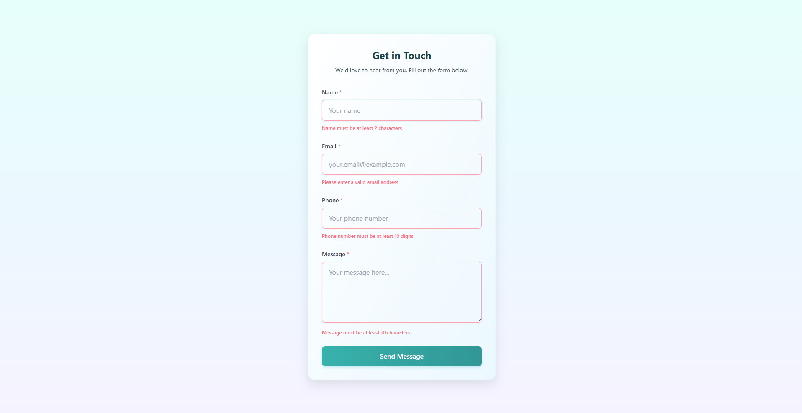

# Task 5 - React Hook From + TypeScript + Vite + Tailwind

This project is a Contact Form implementation built with React Hook Form, TypeScript, Vite, and Tailwind CSS as part of A2SV for Task 5.

## Features

- **Form Handling**: Create and submit contact information with React Hook Form
- **Form Validation**: Comprehensive form validation using Zod schema validation
- **Type Safety**: Fully typed with TypeScript for enhanced developer experience
- **Responsive Design**: Built with Tailwind CSS for a mobile-friendly user interface
- **Modern Build System**: Fast development experience with Vite

## Screenshots

### Contact Form


### Form Validation


### Popup


## Getting Started


### Installation

1. Clone the repository
   ```bash
   git clone https://github.com/yourusername/task-form-react.git
   cd task-form-react
   ```

2. Install dependencies
   ```bash
   pnpm install
   # or
   npm
   ```

3. Run the development server
   ```bash
   npm run dev
   # or
   pnpm dev
   ```


## Technologies Used

- React 19
- TypeScript
- React Hook Form
- Zod for validation
- Tailwind CSS
- Vite
